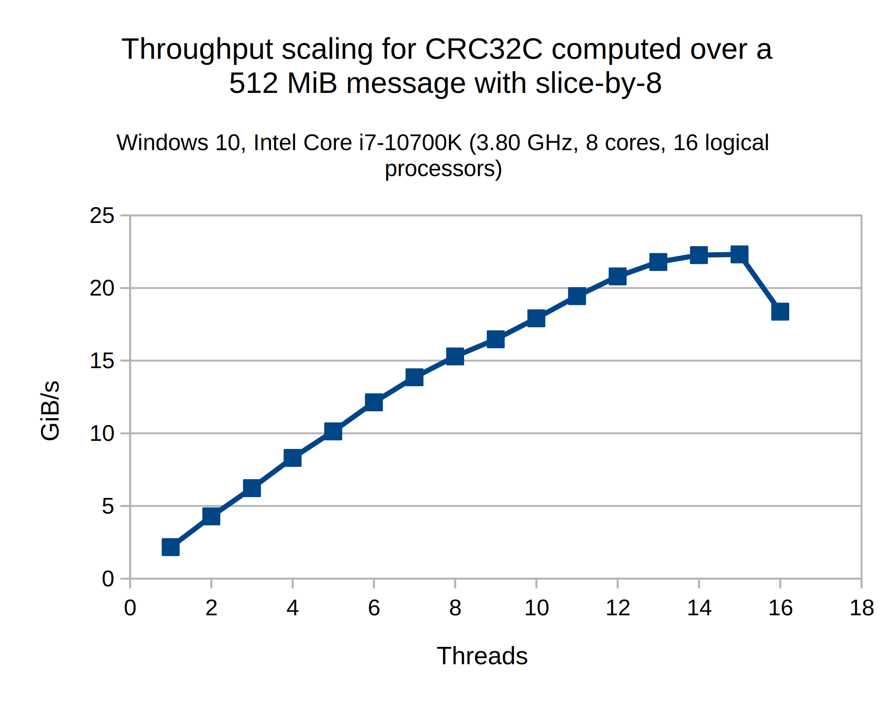

# ZCRC

**Warning: this library is under construction.
It's functional, but its main selling point—SIMD acceleration—is not yet implemented.**

[](https://github.com/LocalSpook/zcrc/actions/workflows/codeql.yml)

A C++20 high-performance constexpr-capable single-header-only CRC library with over 100 predefined CRCs and the ability to create custom ones.

[Try it live right now on Compiler Explorer!](https://godbolt.org/z/4GKsWhvnz)

## API

There are two fundamental CRC operations: *computing* a CRC to append to a message,
and *verifying* whether an existing message is valid. Most likely, all you're looking
for is a simple function that does that for a common CRC variant. Here you go:

```cpp
#include <zcrc/zcrc.hpp> // Or: import zcrc;

// Compute a CRC:
std::string_view data {"Hello world!"};
std::uint32_t crc {zcrc::crc32c::compute(data)};

// Verify a CRC:
if (!zcrc::crc8_bluetooth::is_valid(some_message)) {
    throw std::runtime_error {"Message is corrupted!"};
}
```

For more complex cases, the CRC can be built up incrementally:

```cpp
// Step 1: initialize CRC state.
zcrc::crc64_xz crc {};

// Step 2: feed it data.
// Notice how you can pass in any byte-like type, without any casts.
crc = zcrc::process(crc, "Some data"sv);
crc = zcrc::process(crc, u8" processed in "sv);
crc = zcrc::process(crc, std::vector<std::uint8_t> {'p', 'a', 'r', 't', 's'});

// Step 3: extract the final CRC.
std::uint64_t result {zcrc::finalize(crc)};
assert(result == zcrc::crc64_xz::compute("Some data processed in parts"sv));
```

All the functions above also have overloads taking iterator pairs instead of ranges.
What's more, they accept ranges as weak as input ranges,
although processing is fastest with contiguous sized ranges.

### Choosing an algorithm

There are many algorithms for calculating CRCs.
The library will pick a good default, but it isn't omniscient,
so you have the ability to specify one yourself.
The following algorithms are available:

- `zcrc::slice_by<N>`: process `N` bytes at a time.
  Requires an `N * 256 * sizeof(zcrc::<...>::crc_type)` byte lookup table.
  For example, CRC32C implemented with slice-by-4 requires a 4 KiB lookup table.
- `zcrc::default_algorithm`: used when no algorithm is specified. Currently `zcrc::slice_by<8>`.

To specify an algorithm, pass it as the first parameter to `zcrc::<...>::compute`, `zcrc::<...>::is_valid`, or `zcrc::process`:

```cpp
zcrc::crc32_mpeg2::compute(zcrc::slice_by<8>, ...);

if (!zcrc::crc32_mpeg2::is_valid(zcrc::slice_by<8>, ...)) {
    ...
}

zcrc::crc32_mpeg2 crc {};
crc = zcrc::process(zcrc::slice_by<8>, crc, ...);
```

If you want to write your own functions that take CRC algorithms as arguments,
constrain them with the `zcrc::algorithm` concept:

```cpp
void my_function(zcrc::algorithm auto algo, ...) {
    zcrc::crc32c::compute(algo, ...); // Pass along the algorithm.
}
```

### Parallelizing the computation

Computing CRCs is an embarrassingly parallel problem.
To enable parallelization,
simply wrap an ordinary algorithm with the `zcrc::parallel` adaptor and pass it to a function as you normally would:

```cpp
zcrc::crc32c::compute(zcrc::parallel<zcrc::slice_by<8>>, ...);
```

(The function is still constexpr! It'll just dispatch to a sequential algorithm if evaluated at compile time.)

The parallel algorithm divides the message into as many chunks as the system has hardware threads.
Each thread processes its chunk using the wrapped algorithm (in this case, `zcrc::slice_by<8>`).
Here's what the scaling can look like:



To get specific numbers for your system, build the benchmarks as described in [Building](#building).

### Defining your own CRCs

The CRC you're looking for almost certainly comes predefined
(if it's missing, consider [filing an issue](https://github.com/LocalSpook/zcrc/issues)),
but you can define your own too:

```cpp
using crc32c = zcrc::crc<
    32,         // The polynomial's width.
    0x1EDC6F41, // The polynomial, with an implicit leading term.
    0xFFFFFFFF, // The initial value of the CRC register.
    true,       // True if the bits in a byte should be ordered from LSb to MSb, false if vice-versa.
    true,       // True if the result should be reflected during finalization.
    0xFFFFFFFF  // The value XORed into the result at the very end, after any reflection.
>;
```

Or you can adapt existing CRCs:

```cpp
// Identical to zcrc::crc32, but with the opposite bit ordering.
using crc32_reflected = zcrc::crc<
    zcrc::crc32::width,
    zcrc::crc32::poly,
    zcrc::crc32::initial,
    !zcrc::crc32::refin, // ⭐
    !zcrc::crc32::refout, // ⭐
    zcrc::crc32::xorout
>;
```

Note that CRCs of width greater than 64 are currently unsupported.

### Composability

All provided functions are function objects and can be passed to other algorithms:

```cpp
std::vector<std::string> strings {"Apple", "Banana", "Cherry", "Dragonfruit"};
std::vector<std::uint32_t> crcs {std::from_range, strings | std::views::transform(zcrc::crc32c::compute)};

// Compute a CRC over several noncontiguous chunks.
std::vector<std::vector<unsigned char>> data {...};
std::uint32_t crc {zcrc::finalize(std::ranges::fold_left(data, zcrc::crc32c {}, zcrc::process))};
```

## Installing

### With FetchContent (recommended)

```cmake
set(ZCRC_MODULE ON) # If using the module.
FetchContent_Declare(zcrc
    GIT_REPOSITORY https://github.com/LocalSpook/zcrc
    GIT_TAG v0.1.0
    SYSTEM
)
FetchContent_MakeAvailable(zcrc)

target_link_libraries(... zcrc::zcrc[-module])
```

### With find_package

```cmake
# If consuming the library as a header (#include <zcrc/zcrc.hpp>):
find_package(zcrc REQUIRED)
target_link_libraries(... zcrc::zcrc)

# If consuming the library as a module (import zcrc;):
find_package(zcrc REQUIRED COMPONENTS module)
target_link_libraries(... zcrc::zcrc-module)
```

### With vendoring (discouraged)

Just copy [`include/zcrc/zcrc.hpp`](include/zcrc/zcrc.hpp) into your directory structure.
For any serious project, you're highly recommended to use a proper dependency management
system instead, but this method *is* officially supported.

## Supported toolchains

| Toolchain  | Baseline  | `zcrc::zcrc-module` |
|------------|-----------|---------------------|
| CMake      | ≥ 3.23    | ≥ 3.28              |
| Emscripten | ≥ 3.1.41  | ≥ 4.0.3             |

<!--
Emscripten before 3.1.41 bundles libc++ 15, which has incomplete ranges support
and would be too much of a hassle to support:

https://github.com/emscripten-core/emscripten/blob/main/ChangeLog.md

4.0.3 is the first version Emscripten advertises support for modules.
That support is enough for us, but is still imperfect (see
https://github.com/emscripten-core/emscripten/issues/24454; only fixed in 4.0.10).
--->

## Building

Simply run:

```sh
cmake -B build [-G Ninja]
cmake --build build
```

To build tests, add `-DZCRC_TEST=ON`.
The resulting test binary will be `build/bin/tests`.
Our testing framework is Catch2;
it will be downloaded automatically using FetchContent.
If the project was configured with`-DZCRC_MODULE=ON`,
the module tests will be added to the binary.
We have a 2 by 2 testing matrix:
compile versus run time, and header versus module.
The compile-time tests of course run at build time.
With the runtime tests you have more flexibility:
to test just the header, run `./build/bin/tests [header]`, and
to test just the module, run `./build/bin/tests [module]`.

To build the benchmarks, add `-DZCRC_BENCHMARK=ON`.
The benchmarking framework is also Catch2,
and the resulting binary will be `build/bin/benchmarks`.

Package maintainers can control where ZCRC installs its files with the following options:

|             Option             |                  Default               | Controls  |
|--------------------------------|----------------------------------------|-----------|
| `CMAKE_INSTALL_INCLUDEDIR`     | N/A (CMake builtin)                    | `*.hpp`   |
| `ZCRC_INSTALL_PKGCONFIG_DIR`   | `${CMAKE_INSTALL_LIBDIR}/pkgconfig`    | `zcrc.pc` |
| `ZCRC_INSTALL_CMAKE_FILES_DIR` | `${CMAKE_INSTALL_LIBDIR}/cmake/zcrc`   | `*.cmake` |
| `ZCRC_INSTALL_MODULE_DIR`      | `${CMAKE_INSTALL_INCLUDEDIR}/zcrc/src` | `*.cppm`  |

## Miscellaneous

- This library provides zero ABI stability guarantees.
- It should compile cleanly even at very high warning levels.
  If you see a warning, [file an issue](https://github.com/LocalSpook/zcrc/issues).
