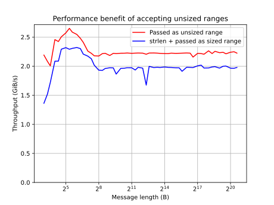

# `cstr.svg`



The checked-in `cstr.svg` was generated on a Windows 10 system with an
Intel Core i7-10700K 3.80 GHz CPU, compiled with `clang++ -O3 -march=native`.

To generate one for your system, run from the project root:

```sh
python -m venv .venv
source .venv/bin/activate
pip install matplotlib
./build/bin/benchmarks cstr --reporter XML -o build/cstr.xml
./benchmark/construct_cstr_graph.py -i build/cstr.xml -o build/cstr.svg
```
